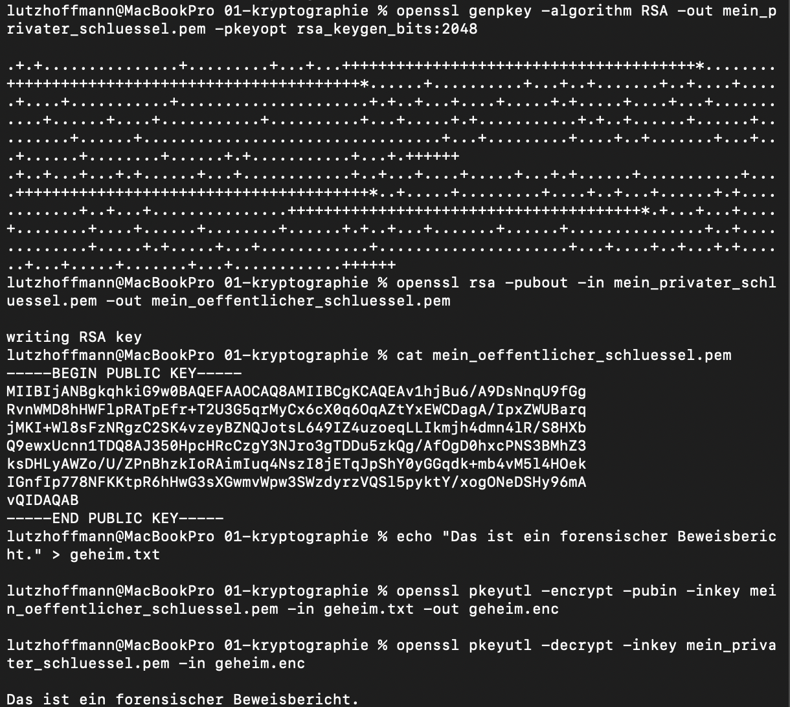

# Praxis-Projekt: Asymmetrische Verschlüsselung mit OpenSSL

## Ziel des Projekts
Praktisches Verständnis der Public-Key-Kryptographie (angestoßen durch das TryHackMe-Modul "Cybersecurity 101").

## Durchführung (Hands-on)
Ich habe mithilfe von OpenSSL im Terminal ein asymmetrisches RSA-Schlüsselpaar (2048 Bit) erzeugt, eine Textdatei verschlüsselt und wieder entschlüsselt.

1. **Schlüsselgenerierung:** 
   `openssl genpkey -algorithm RSA...`
2. **Verschlüsselung:** 
   Die Datei `geheim.txt` wurde mit dem Public Key in `geheim.enc` umgewandelt.
3. **Entschlüsselung:** 
   Nur durch den passenden Private Key konnte der Klartext im Terminal wiederhergestellt werden.

## Relevanz für die Cyber-Forensik
In der digitalen Forensik begegnet uns dieses Konzept ständig:
* **Ransomware-Analyse:** Erpressertrojaner nutzen genau dieses Prinzip. Sie verschlüsseln Opfer-Daten mit einem Public Key. Der Private Key liegt auf dem Server der Angreifer. Ohne ihn ist eine Entschlüsselung mathematisch unmöglich.
* **Sichere Kommunikation:** Verständnis von TLS/HTTPS-Zertifikaten bei der Analyse von verschlüsseltem Netzwerkverkehr.

